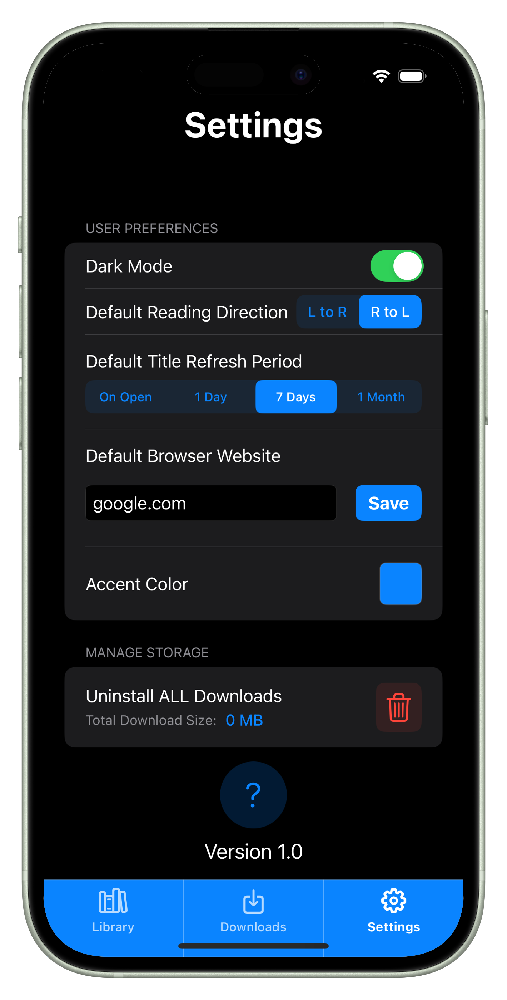
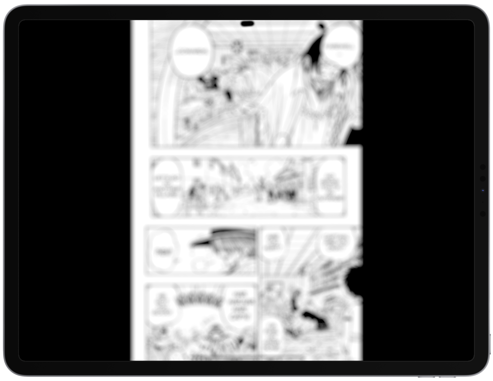

# MangaDen - Ultimate Manga & Comic Reader

  

  **Your personal manga and comic library in your pocket**

  
  
  

## About MangaDen

MangaDen is the ultimate manga reader and comic reader app that brings your favorite stories to life. Discover thousands of titles from across the web and build your personal digital library. Download chapters for offline enjoyment and experience seamless reading with customizable settings perfect for both manga enthusiasts and comic book lovers.

### Key Features

- **📚 Smart Library Management** - Organize your collection with reading and archive sections
- **🌐 Built-in Web Browser** - Discover new titles with automatic content detection
- **⬇️ Smart Downloads** - Download chapters for offline reading with pause/resume
- **📖 Customizable Reader** - Configurable reading directions (LTR/RTL) with zoom and bookmarks
- **🔄 Auto-Refresh** - Automatic chapter updates with customizable periods
- **🎨 Personalization** - Dark/light mode with accent colors and tailored settings

## 🖼️ Screenshots

### iPhone

| | | | |
|:---:|:---:|:---:|:---:|
|  |  |  |  |
|  |  |  |  |

### iPad

| | |
|:---:|:---:|
|  |  |
|  |  |
|  |  |
|  |  |

## 🚀 Getting Started

### Prerequisites
- iOS 17.0 or later
- Xcode 15.0 or later
- Swift 5.0

### Installation
1. Clone the repository
2. Open the project in Xcode
3. Build and run on your device or simulator